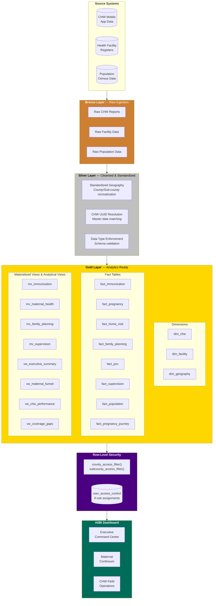
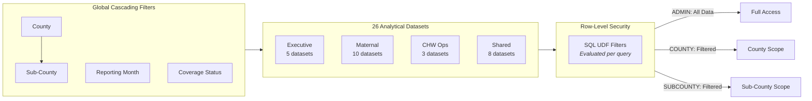
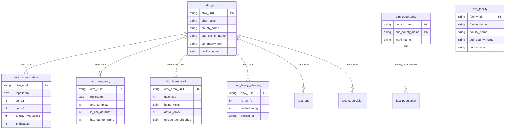
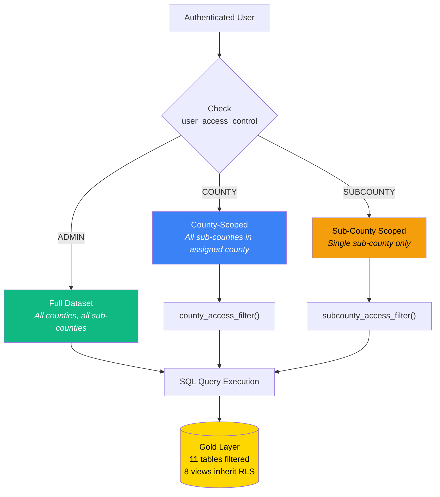

<div align="center">

# 🏥 Community Health Intelligence Platform

### Real-Time Decision Intelligence for Kenya's Community Health Worker Program

[](https://databricks.com)
[](https://delta.io)
[](https://databricks.com/product/unity-catalog)
[](LICENSE)

**An end-to-end analytics platform transforming raw community health data into actionable intelligence — from bronze ingestion through gold-layer analytics to executive dashboards with enterprise-grade row-level security.**

[Explore the Dashboard](#-dashboard-pages) · [Architecture](#-architecture) · [Data Model](#-data-model) · [Security](#-row-level-security) · [Getting Started](#-getting-started)

</div>

---

## 📋 Table of Contents

- [Executive Summary](#-executive-summary)
- [Dashboard Pages](#-dashboard-pages)
- [Architecture](#-architecture)
- [Data Model](#-data-model)
- [Row-Level Security](#-row-level-security)
- [Performance Engineering](#-performance-engineering)
- [Data Quality Framework](#-data-quality-framework)
- [Repository Structure](#-repository-structure)
- [Getting Started](#-getting-started)
- [Technical Specifications](#-technical-specifications)

---

## 📊 Executive Summary

This platform serves as the **central nervous system** for Kenya's community health program, synthesizing data from **4,671 Community Health Workers** across **2 counties** and **17 sub-counties** into a unified decision-support system.

<table>
<tr>
<td width="33%" align="center">
<h3>3.2M+</h3>
<p>Household Visits Tracked</p>
</td>
<td width="33%" align="center">
<h3>339K</h3>
<p>Unique Beneficiaries</p>
</td>
<td width="33%" align="center">
<h3>26</h3>
<p>Analytical Datasets</p>
</td>
</tr>
<tr>
<td align="center">
<h3>19</h3>
<p>Gold-Layer Tables & Views</p>
</td>
<td align="center">
<h3>9</h3>
<p>RLS-Protected User Roles</p>
</td>
<td align="center">
<h3>5</h3>
<p>Months of Longitudinal Data</p>
</td>
</tr>
</table>

### The Challenge

County and sub-county health managers lacked a unified view of community health performance. Data lived in siloed systems, making it impossible to identify coverage gaps, track the maternal care continuum, or monitor CHW productivity at scale. Decision-makers needed **role-appropriate, real-time analytics** without compromising data governance.

### The Solution

A **three-tier analytics platform** built on Databricks Lakehouse architecture that:

- **Ingests** raw health records through a medallion pipeline (Bronze → Silver → Gold)
- **Models** complex health domain relationships across immunization, maternal care, family planning, and CHW operations
- **Secures** data with function-based row-level security ensuring each user sees only their authorized scope
- **Delivers** insights through a 3-page executive dashboard with cascading drill-down filters

---

## 📸 Dashboard Pages

### Page 1: Executive Command Center

> Strategic overview for program leadership — key coverage indicators, geographic performance rankings, and cross-domain health metrics at a glance.

<p align="center">
  
</p>

**Key Capabilities:**
- **6 real-time KPI counters** spanning immunization (Penta3: 60.8%), maternal health (ANC4+: 25.7%), and workforce metrics
- **Sub-county performance rankings** with conditional status classification (On Track / At Risk / Critical)
- **Cross-domain synthesis** — immunization coverage, mCPR gauge with target overlay, and maternal care funnel in a single view
- **County-level immunization comparison** with interactive drill-down

---

### Page 2: Maternal Continuum of Care

> End-to-end visibility into the maternal health cascade — from first antenatal contact through postnatal care, with dropout detection at every stage.

<p align="center">
  
</p>

**Key Capabilities:**
- **6-stage cascade funnel** (ANC1 → ANC2 → ANC3 → ANC4+ → Skilled Delivery → PNC) quantifying drop-off at each transition
- **County comparison analysis** — Busia vs. Kisumu across all maternal indicators revealing a **2.5× defaulter rate disparity**
- **Sub-county performance matrix** with status-based conditional formatting for rapid triage
- **Dual-axis monthly trend** tracking ANC4+ completion and defaulter rates over time
- **Delta insight cards** showing month-over-month directional changes

---

### Page 3: CHW Field Operations

> Operational intelligence for workforce management — productivity monitoring, visit pattern analysis, and zone-level performance tracking.

<p align="center">
  
</p>

**Key Capabilities:**
- **CHW productivity distribution** with configurable threshold bins for performance segmentation
- **Clinical visit type breakdown** — isolating immunization (80.8%), defaulter follow-up (14.2%), and ANC visits (5.0%) from household visit noise
- **Monthly visit volume trends** with county-level color segmentation
- **Zone performance table** correlating CHW density with immunization coverage outcomes

---

## 🏗 Architecture

### Lakehouse Medallion Architecture



### Dashboard Data Flow



---

## 📐 Data Model

### Star Schema Design



### Metric Definitions

| Metric | Formula | Business Context |
|--------|---------|-----------------|
| **Penta3 Coverage** | `SUM(penta3) / COUNT(*)` | % of tracked children completing 3rd pentavalent dose |
| **ANC4+ Rate** | `SUM(anc_complete) / COUNT(*)` | % of pregnancies with ≥4 antenatal visits (WHO standard) |
| **Defaulter Rate** | `SUM(is_anc_defaulter) / COUNT(*)` | % of pregnancies missing scheduled ANC visits |
| **mCPR** | `SUM(on_fp) / SUM(wra_pop)` | Modern contraceptive prevalence among women of reproductive age |
| **Skilled Delivery** | `SUM(skilled_delivery) / COUNT(*)` | % of deliveries at health facilities with skilled attendants |
| **Avg Daily Visits** | `SUM(visits) / (SUM(active_months) × 22)` | Estimated daily household visits per CHW (22 working days/month) |

---

## 🔐 Row-Level Security

### Multi-Tier Access Control Architecture

The platform implements **function-based row-level security** through Unity Catalog, ensuring data governance without application-layer complexity.



### Security Implementation

| Component | Detail |
|-----------|--------|
| **Authentication** | Databricks workspace SSO via `CURRENT_USER()` |
| **Authorization** | `user_access_control` mapping table (9 roles) |
| **Enforcement** | SQL UDF row filters using `EXISTS()` subqueries |
| **Scope** | 11 gold tables with explicit row filters |
| **Inheritance** | 8 views automatically inherit parent table RLS |
| **Performance** | Filter pushdown — evaluated at storage layer, not application |

### Access Matrix

| Role | Scope | Tables Visible | Example User |
|------|-------|---------------|-------------|
| `ADMIN` | All data across all counties | 11 tables, unrestricted | Program Director |
| `COUNTY` | All sub-counties within assigned county | 11 tables, county-filtered | County Health Manager |
| `SUBCOUNTY` | Single sub-county only | 11 tables, sub-county-filtered | Sub-County Health Officer |

> **Design Decision:** RLS is implemented at the **storage layer** via Unity Catalog row filters rather than application-layer WHERE clauses. This ensures security is enforced regardless of access path — dashboard, notebook, SQL editor, or API.

---

## ⚡ Performance Engineering

### Optimization Strategies Implemented

| Challenge | Solution | Impact |
|-----------|----------|--------|
| Slow materialized view (`mv_maternal_health`) | Bypassed with direct `fact_pregnancy` aggregation | Query time: **timeout → <3s** |
| 26 datasets competing for warehouse resources | Staggered refresh with priority-based scheduling | Eliminated "Query cancelled" errors |
| 99.6% dominance of HH visits masking clinical data | Pre-filtered clinical visit dataset | Revealed **Immunization 80.8%, ANC 5.0%** split |
| Monthly `date_key` (YYYYMM) misread as daily | Applied `×22 working days` normalization | Corrected avg visits from **191.8 → 8.7/day** |
| UNKNOWN county records (96K visits, 8.8%) | Root-cause analysis → CHW UUID gap identification | **91.5%** traced to known counties |

### Warehouse Configuration

- **Compute:** Serverless SQL Warehouse (auto-scaling)
- **Caching:** Result caching enabled for repeated filter combinations
- **Concurrency:** Dashboard published with embedded credentials (run-as-owner) to leverage single connection pool

---

## 🔍 Data Quality Framework

### Identified Quality Dimensions

| Issue | Records Affected | Root Cause | Resolution |
|-------|-----------------|------------|------------|
| UNKNOWN county mapping | 96,712 home visits (8.8%) | 558 CHWs with UUIDs absent from `dim_chw` master data | Traced 91.5% to Busia (71.6%) and Kisumu (19.9%) via bronze-layer cross-reference |
| Unmapped facilities | 130 facilities | NULL county/sub-county in `dim_facility` | Identified by facility name pattern matching (e.g., "NAMBALE SUB COUNTY HOSPITAL" → Busia) |
| Temporal data asymmetry | — | Different domains cover different time ranges | Documented: Home visits (5mo), Immunization (3mo), Pregnancy (2mo) |

### Data Lineage

```
Source Systems → Bronze (raw) → Silver (cleansed) → Gold (modeled)
                                  ↓                    ↓
                            UUID resolution      Row filters applied
                            Geography normalization   Views created
                            Schema enforcement        Metrics calculated
```

---

## 📁 Repository Structure

```
community-health-intelligence-platform/
│
├── 📊 dashboards/
│   └── community_health_intelligence_platform.lvdash.json    # Full dashboard definition
│
├── 📓 notebooks/
│   ├── chw_semantic_model.ipynb          # Data model & ETL pipeline
│   ├── rls_setup.ipynb                   # Row-Level Security configuration
│   └── chw_rls_setup.ipynb               # CHW-specific RLS setup
│
├── 🗃 sql/
│   ├── datasets/                          # Dashboard dataset queries (24 files)
│   │   ├── _all_datasets.sql             # Combined reference
│   │   ├── executive_kpis.sql            # Executive Command Center queries
│   │   ├── maternal_funnel.sql           # Maternal cascade analysis
│   │   ├── chw_field_ops.sql             # CHW operations queries
│   │   └── ...                           # 21 additional dataset queries
│   ├── schema/
│   │   └── gold_layer_ddl.sql            # Complete gold layer DDL (11 tables, 8 views)
│   ├── security/
│   │   └── rls_setup.sql                 # RLS functions & row filter application
│   ├── rls_functions.sql                 # Standalone RLS function definitions
│   └── sample_queries.sql                # Analytical query examples
│
├── 📖 docs/
│   ├── data_dictionary.md                # Column-level documentation
│   └── rls_access_matrix.md              # Security role assignments
│
├── 🖼 images/                             # Dashboard screenshots
│   ├── 01_executive_command_center.png
│   ├── 02_maternal_continuum_of_care.png
│   └── 03_chw_field_operations.png
│
├── README.md
├── LICENSE
└── .gitignore
```

---

## 🚀 Getting Started

### Prerequisites

| Requirement | Detail |
|------------|--------|
| Databricks Workspace | AWS with Unity Catalog enabled |
| SQL Warehouse | Serverless recommended for auto-scaling |
| Catalog | `community_health_intelligence` with `bronze`, `silver`, `gold` schemas |
| Permissions | `CREATE FUNCTION`, `ALTER TABLE` on gold schema for RLS setup |

### Deployment Steps

```bash
# 1. Clone repository into Databricks Git folder
#    Workspace → Create → Git folder → paste repo URL

# 2. Run the data model notebook to create gold-layer tables
#    Open notebooks/chw_semantic_model.ipynb → Run All

# 3. Configure Row-Level Security
#    Open notebooks/rls_setup.ipynb → Run All
#    This creates: functions, user_access_control table, row filters

# 4. Import the dashboard
#    Workspace → Import → Upload dashboards/*.lvdash.json

# 5. Publish with embedded credentials
#    Dashboard → Publish → Enable "Run as owner" → Select warehouse
```

### Cascading Global Filters

The dashboard implements **4 cascading filters** that propagate across all pages:

| Filter | Binds To | Behavior |
|--------|----------|----------|
| **County** | 12 datasets | Primary geographic filter |
| **Sub-County** | 10 datasets | Cascades from county selection |
| **Reporting Month** | 3 datasets | Temporal filter on `reportedm` |
| **Coverage Status** | 2 datasets | On Track / At Risk / Critical |

---

## 🔧 Technical Specifications

| Component | Technology |
|-----------|-----------|
| **Cloud Platform** | AWS |
| **Analytics Platform** | Databricks Lakehouse |
| **Storage Format** | Delta Lake |
| **Data Governance** | Unity Catalog |
| **Compute** | Serverless SQL Warehouse |
| **Dashboard** | Databricks AI/BI (Lakeview) |
| **Security** | Row-Level Security via SQL UDFs |
| **Version Control** | Git (GitHub) |
| **Data Architecture** | Medallion (Bronze → Silver → Gold) |
| **Schema Design** | Star Schema (Kimball methodology) |

### Data Coverage

| Domain | Time Range | Grain | Volume |
|--------|-----------|-------|--------|
| Home Visits | Dec 2024 – Apr 2025 | CHW × Month | 3.2M visits |
| Immunization | Jan 2025 – Mar 2025 | CHW × Month × Community Unit | 5,874 fully immunized |
| Pregnancy/ANC | Jan 2025 – Feb 2025 | Individual pregnancy | 25.7% ANC4+ rate |
| Family Planning | Jan 2025 – Feb 2025 | Monthly summary | 3.6% mCPR |
| Supervision | Jan 2025 – Feb 2025 | CHW assessment | 4,671 active CHWs |

---

<div align="center">

### Built with

[](https://databricks.com)
[](https://spark.apache.org)
[](https://delta.io)

**[Erick Yegon](https://github.com/erickyegon)** · Data & Analytics Engineer

*Transforming community health data into actionable intelligence*

</div>
