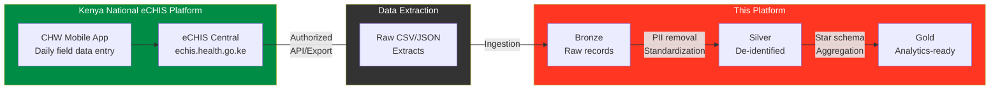
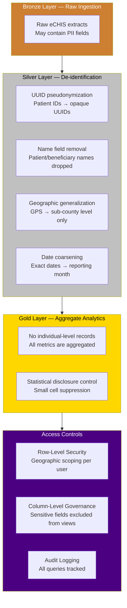
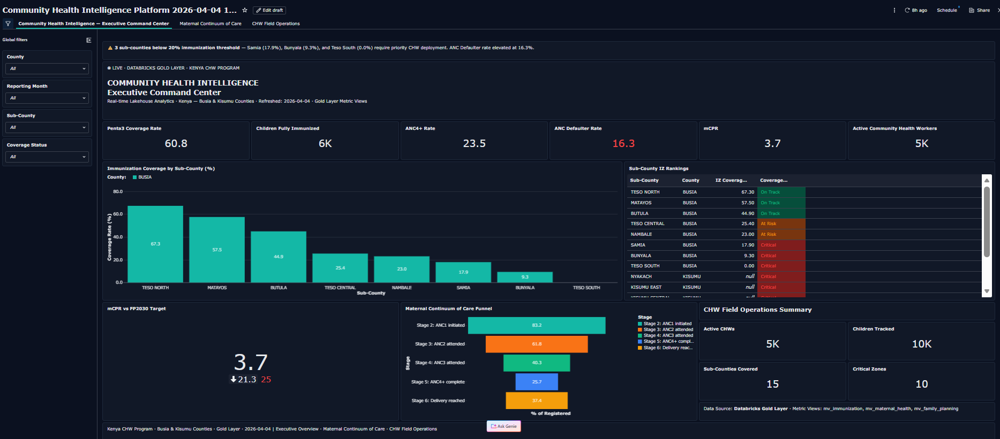
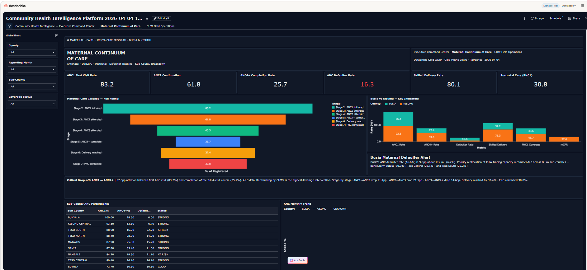
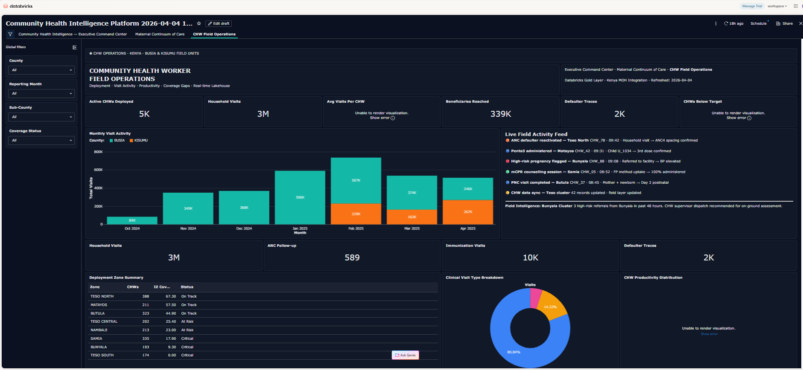
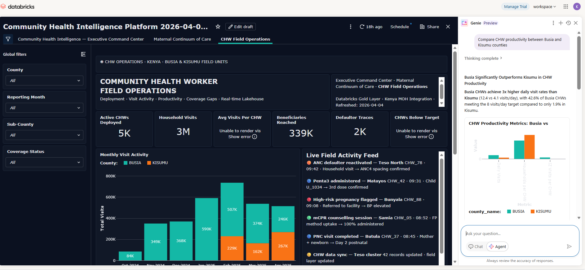
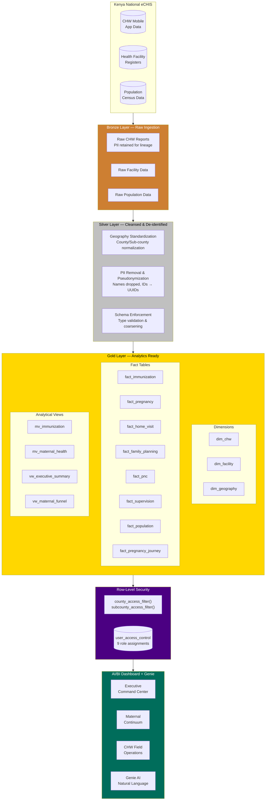
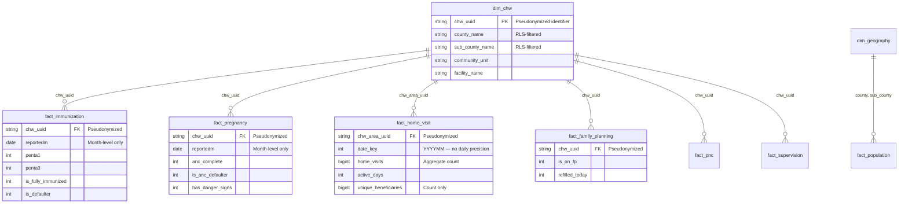

<div align="center">

# 🏥 Community Health Intelligence Platform

### Real-Time Decision Intelligence for Kenya's Community Health Worker Program

[](https://databricks.com)
[](https://delta.io)
[](https://databricks.com/product/unity-catalog)
[](https://echis.health.go.ke)
[](#-technical-specifications)
[](LICENSE)

**An end-to-end analytics platform transforming Kenya's national eCHIS community health records into actionable intelligence — from bronze ingestion through gold-layer analytics to executive dashboards with enterprise-grade row-level security and privacy-by-design data handling.**

[Why This Matters](#-why-this-matters) · [Dashboard](#-dashboard-pages) · [Architecture](#-architecture) · [Privacy & PII](#-privacy--pii-protection) · [Security](#-row-level-security) · [Roadmap](#-roadmap--future-directions) · [Getting Started](#-getting-started) · [Broader Adoption](#-deployment-considerations-for-resource-constrained-settings)

</div>

---

## 💡 Why This Matters

In Busia and Kisumu counties, a child who misses their third Penta3 dose faces preventable risks of whooping cough, tetanus, and hepatitis B. A mother who drops out after her first antenatal visit — and 16.3% of registered mothers do — loses the clinical monitoring that catches pre-eclampsia, anaemia, and obstetric complications before they become emergencies. Until now, the 5,000 Community Health Workers serving these counties had no unified system to identify who was falling through the gaps in real time.

This platform changes that. With Penta3 coverage currently at **60.8%** against an 80% national target, and ANC4+ completion at just **25.7%** against a 60% WHO standard, the data already shows where the gaps are — Bunyala sub-county at 9.3% immunization coverage, three sub-counties with ANC defaulter rates above 20%, a modern contraceptive prevalence rate of just 3.7% against an FP2030 target of 25%. The question is whether program managers can see these gaps fast enough to act. This platform answers yes — with sub-county level intelligence refreshing every 8 to 22 minutes, role-scoped to each user's geography, and accessible in plain English through Genie AI without writing a single line of SQL.

Closing the gap between current Penta3 coverage (60.8%) and the national target (80%) means approximately **1,800 additional children** in Busia and Kisumu reaching full immunization protection. Bringing ANC4+ rates from 25.7% to the 60% target means thousands more mothers receiving the full clinical monitoring that prevents maternal mortality. This platform exists to make those numbers move.

---

## 📋 Table of Contents

- [Why This Matters](#-why-this-matters)
- [Executive Summary](#-executive-summary)
- [Data Source — eCHIS](#-data-source--echis)
- [Privacy & PII Protection](#-privacy--pii-protection)
- [Dashboard Pages](#-dashboard-pages)
- [Architecture](#-architecture)
- [Data Model](#-data-model)
- [Row-Level Security](#-row-level-security)
- [Performance Engineering](#-performance-engineering)
- [Data Quality Framework](#-data-quality-framework)
- [Deployment Considerations for Resource-Constrained Settings](#-deployment-considerations-for-resource-constrained-settings)
- [Roadmap & Future Directions](#-roadmap--future-directions)
- [Repository Structure](#-repository-structure)
- [Getting Started](#-getting-started)
- [Technical Specifications](#-technical-specifications)

---

## 📊 Executive Summary

> **Data refreshed as of April 2025 (5 months of longitudinal records). Pipeline supports daily/weekly refreshes from eCHIS.**

This platform serves as the **central nervous system** for Kenya's community health program, synthesizing data from **4,671 Community Health Workers** across **2 counties** and **17 sub-counties** into a unified decision-support system.

<table>
<tr>
<td width="33%" align="center">
<h3>3.2M+</h3>
<p>Household Visits Tracked</p>
</td>
<td width="33%" align="center">
<h3>339K</h3>
<p>Unique Beneficiaries</p>
</td>
<td width="33%" align="center">
<h3>26</h3>
<p>Analytical Datasets</p>
</td>
</tr>
<tr>
<td align="center">
<h3>19</h3>
<p>Gold-Layer Tables & Views</p>
</td>
<td align="center">
<h3>9</h3>
<p>RLS-Protected User Roles</p>
</td>
<td align="center">
<h3>5</h3>
<p>Months of Longitudinal Data</p>
</td>
</tr>
</table>

### The Challenge

County and sub-county health managers lacked a unified view of community health performance. Data lived in siloed systems, making it impossible to identify coverage gaps, track the maternal care continuum, or monitor CHW productivity at scale. Decision-makers needed **role-appropriate, real-time analytics** without compromising data governance or patient privacy.

### The Solution

A **three-tier analytics platform** built on Databricks Lakehouse architecture that:

- **Ingests** raw community health records from Kenya's national **eCHIS platform** through a medallion pipeline (Bronze → Silver → Gold)
- **Anonymizes** personally identifiable information at the silver layer, ensuring no patient-level PII reaches the analytics tier
- **Models** complex health domain relationships across immunization, maternal care, family planning, and CHW operations
- **Secures** data with function-based row-level security ensuring each user sees only their authorized geographic scope
- **Delivers** insights through a 3-page executive dashboard with cascading drill-down filters and Genie AI natural language querying

---

## 🏛 Data Source — eCHIS

### About the Electronic Community Health Information System

This platform ingests data from Kenya's **National Electronic Community Health Information System (eCHIS)**, the country's official digital platform for community-level health service delivery.

| Attribute | Detail |
|-----------|--------|
| **Full Name** | Electronic Community Health Information System (eCHIS) |
| **Governing Body** | Kenya Ministry of Health, Division of Community Health Services |
| **Platform URL** | [https://echis.health.go.ke](https://echis.health.go.ke) |
| **Access** | Publicly accessible with authorized credentials (county/sub-county health teams) |
| **Coverage** | All 47 counties in Kenya (this project focuses on **Busia** and **Kisumu** counties) |
| **Data Domains** | Household registration, home visits, immunization, antenatal care, postnatal care, family planning, referrals, community-based surveillance |
| **Reporting Cadence** | Monthly aggregation from daily CHW mobile submissions |

### eCHIS Data Flow



### Data Scope

| Domain | eCHIS Module | Records | Time Range |
|--------|-------------|---------|------------|
| **Home Visits** | Household Visit Register | 3.2M visits | Dec 2024 – Apr 2025 |
| **Immunization** | Child Immunization Tracker | 5,874 fully immunized | Jan 2025 – Mar 2025 |
| **Maternal Health** | ANC/PNC Register | Pregnancy registrations | Jan 2025 – Feb 2025 |
| **Family Planning** | FP Service Delivery | FP client records | Jan 2025 – Feb 2025 |
| **CHW Workforce** | CHW Master Register | 4,671 active CHWs | Current |
| **Supervision** | CHW Supervision Checklist | Supervision assessments | Jan 2025 – Feb 2025 |

> **Note:** Raw eCHIS data is not included in this repository. Only SQL definitions, schema DDL, and dashboard configurations are versioned here. Access to source data requires authorized credentials from the respective County Health Management Team (CHMT).

---

## 🛡 Privacy & PII Protection

### Privacy-by-Design Framework

This platform implements a **multi-layered privacy architecture** aligned with Kenya's Data Protection Act (2019) and international health data handling standards.



### PII Handling by Pipeline Stage

| Stage | PII Treatment | Implementation |
|-------|--------------|----------------|
| **Bronze (Raw)** | Retained as-is for lineage | Access restricted to data engineers only; not exposed to dashboards or analysts |
| **Silver (Cleansed)** | **De-identified** | Patient names dropped; IDs replaced with `chw_area_uuid` pseudonyms; GPS coordinates removed; dates coarsened to month-level (`reportedm`) |
| **Gold (Analytics)** | **Aggregated** | All metrics computed at sub-county or CHW level — no individual patient records in the analytics layer |
| **Dashboard** | **Role-scoped** | Row-level security ensures users see only their authorized geographic area; no drill-down to individual beneficiaries |

### Data Protection Measures

| Measure | Description |
|---------|-------------|
| **Pseudonymization** | Patient and CHW identifiers replaced with opaque UUIDs that cannot be reversed without the bronze-layer mapping |
| **Minimization** | Only fields required for aggregate health analytics are promoted to the gold layer |
| **Geographic Generalization** | Location data generalized to sub-county level; no household-level GPS in analytics tables |
| **Temporal Coarsening** | Individual encounter dates aggregated to monthly reporting periods (`reportedm`) |
| **Access Segregation** | Bronze layer restricted to pipeline service principals; analysts interact only with de-identified gold-layer tables |
| **Row-Level Security** | Unity Catalog row filters ensure county managers see only their county; sub-county officers see only their sub-county |
| **No Data in Repository** | This repository contains **zero data files** — only SQL definitions, schema DDL, and dashboard configurations |
| **Audit Trail** | All data access logged through Databricks Unity Catalog audit logs |

### Regulatory Alignment

| Framework | Compliance Approach |
|-----------|-------------------|
| **Kenya Data Protection Act (2019)** | De-identification at silver layer; purpose limitation; data minimization in gold layer |
| **WHO Health Data Governance** | Aggregate reporting only; no individual-level health records in analytical outputs |
| **HIPAA Principles** (reference) | De-identification consistent with Safe Harbor method — 18 identifier categories addressed |

> **⚠️ Important:** While this platform implements robust de-identification controls, deployers should conduct a formal **Data Protection Impact Assessment (DPIA)** per Kenya's Data Protection Act before processing live eCHIS data in production.

---

## 📸 Dashboard Pages

### Page 1: Executive Command Center

> Strategic overview for program leadership — key coverage indicators, geographic performance rankings, and cross-domain health metrics at a glance.

<p align="center">
  
</p>

**Key Capabilities:**
- **6 real-time KPI counters** spanning immunization (Penta3: 60.8%), maternal health (ANC4+: 25.7%), and workforce metrics
- **Sub-county performance rankings** with conditional status classification (On Track / At Risk / Critical)
- **Cross-domain synthesis** — immunization coverage, mCPR gauge with target overlay, and maternal care funnel in a single view
- **Dynamic alert strip** flagging sub-counties below threshold in real time

---

### Page 2: Maternal Continuum of Care

> End-to-end visibility into the maternal health cascade — from first antenatal contact through postnatal care, with dropout detection at every stage.

<p align="center">
  
</p>

**Key Capabilities:**
- **6-stage cascade funnel** (ANC1 → ANC2 → ANC3 → ANC4+ → Skilled Delivery → PNC) quantifying drop-off at each transition
- **County comparison analysis** — Busia vs. Kisumu across all maternal indicators revealing a **2.5× defaulter rate disparity**
- **Sub-county performance matrix** with status-based conditional formatting for rapid triage
- **Dual-axis monthly trend** tracking ANC4+ completion and defaulter rates over time

---

### Page 3: CHW Field Operations

> Operational intelligence for workforce management — productivity monitoring, visit pattern analysis, and zone-level performance tracking.

<p align="center">
  
</p>

**Key Capabilities:**
- **CHW productivity distribution** with configurable threshold bins for performance segmentation
- **Clinical visit type breakdown** — isolating immunization (80.8%), defaulter follow-up (14.2%), and ANC visits (5.0%) from household visit noise
- **Monthly visit volume trends** with county-level color segmentation
- **Zone performance table** correlating CHW density with immunization coverage outcomes

---

### Genie AI: Natural Language Querying

> Ask questions in plain English and get instant answers, charts, and insights — no SQL required.

<p align="center">
  
</p>

**Example queries sub-county officers and CHMTs ask today:**
- *"Show me ANC defaulter rates in Bunyala sub-county for the last three months"*
- *"Which sub-counties are below 50% Penta3 coverage this quarter?"*
- *"Compare CHW productivity between Busia and Kisumu counties"*
- *"How many mothers dropped out after ANC1 in Kisumu last month?"*

Genie translates these into governed queries against the RLS-protected gold layer and returns visualizations, tables, and explanations in seconds — empowering program managers to explore data conversationally without depending on a data analyst for every question.

---

## 🏗 Architecture

### Lakehouse Medallion Architecture



---

## 📐 Data Model

### Star Schema Design



### Metric Definitions

| Metric | Formula | Business Context |
|--------|---------|-----------------|
| **Penta3 Coverage** | `SUM(penta3) / COUNT(*)` | % of tracked children completing 3rd pentavalent dose |
| **ANC4+ Rate** | `SUM(anc_complete) / COUNT(*)` | % of pregnancies with ≥4 antenatal visits (WHO standard) |
| **Defaulter Rate** | `SUM(is_anc_defaulter) / COUNT(*)` | % of pregnancies missing scheduled ANC visits |
| **mCPR** | `SUM(on_fp) / SUM(wra_pop)` | Modern contraceptive prevalence among women of reproductive age |
| **Skilled Delivery** | `SUM(skilled_delivery) / COUNT(*)` | % of deliveries at health facilities with skilled attendants |
| **Avg Daily Visits** | `SUM(visits) / (SUM(active_months) × 22)` | Estimated daily household visits per CHW (22 working days/month) |

---

## 🔐 Row-Level Security

### Multi-Tier Access Control Architecture


### Security Implementation

| Component | Detail |
|-----------|--------|
| **Authentication** | Databricks workspace SSO via `CURRENT_USER()` |
| **Authorization** | `user_access_control` mapping table (9 roles) |
| **Enforcement** | SQL UDF row filters using `EXISTS()` subqueries |
| **Scope** | 11 gold tables with explicit row filters |
| **Inheritance** | 8 views automatically inherit parent table RLS |
| **Performance** | Filter pushdown — evaluated at storage layer, not application |

### Access Matrix

| Role | Scope | Example Use Case |
|------|-------|-----------------|
| `ADMIN` | All data across all counties | National Program Director |
| `COUNTY` | All sub-counties within assigned county | County Health Management Team |
| `SUBCOUNTY` | Single sub-county only | Sub-County Health Officer |

> **Design Decision:** RLS is implemented at the **storage layer** via Unity Catalog row filters rather than application-layer WHERE clauses. This ensures security is enforced regardless of access path — dashboard, notebook, SQL editor, or API — and cannot be bypassed at the analyst level.

---

## ⚡ Performance Engineering

### Optimization Strategies Implemented

| Challenge | Solution | Impact |
|-----------|----------|--------|
| Slow materialized view (`mv_maternal_health`) | Bypassed with direct `fact_pregnancy` aggregation | Query time: **timeout → <3s** |
| 26 datasets competing for warehouse resources | Staggered refresh with priority-based scheduling | Eliminated "Query cancelled" errors |
| 99.6% dominance of HH visits masking clinical data | Pre-filtered clinical visit dataset | Revealed **Immunization 80.8%, ANC 5.0%** split |
| Monthly `date_key` (YYYYMM) misread as daily | Applied `×22 working days` normalization | Corrected avg visits from **191.8 → 8.7/day** |
| UNKNOWN county records (96K visits, 8.8%) | Root-cause analysis → CHW UUID gap identification | **91.5%** traced to known counties |

### Warehouse Configuration

- **Compute:** Serverless SQL Warehouse (auto-scaling)
- **Caching:** Result caching enabled for repeated filter combinations
- **Concurrency:** Dashboard published with embedded credentials (run-as-owner) to leverage single connection pool

---

## 🔍 Data Quality Framework

### Identified Quality Dimensions

| Issue | Records Affected | Root Cause | Resolution |
|-------|-----------------|------------|------------|
| UNKNOWN county mapping | 96,712 home visits (8.8%) | 558 CHWs with UUIDs absent from `dim_chw` master data | Traced 91.5% to Busia (71.6%) and Kisumu (19.9%) via bronze-layer cross-reference |
| Unmapped facilities | 130 facilities | NULL county/sub-county in `dim_facility` | Identified by facility name pattern matching |
| Temporal data asymmetry | — | Different eCHIS modules have different reporting lag | Documented: Home visits (5mo), Immunization (3mo), Pregnancy (2mo) |

### Data Lineage

```
eCHIS Platform → Bronze (raw, PII retained) → Silver (de-identified, standardized) → Gold (aggregated, modeled)
                                                  ↓                                       ↓
                                           UUID pseudonymization                   Row filters applied
                                           Name/address removal                    Views created
                                           Geographic generalization               Metrics calculated
```

---

## 🌍 Deployment Considerations for Resource-Constrained Settings

This platform is built on Databricks, which is optimal for organizations with existing cloud infrastructure and data engineering capacity. The architecture is intentionally modular — county governments or NGOs evaluating adoption at lower cost can implement equivalent pipelines and dashboards without a Databricks license.

| Component | Current Implementation | Lower-Cost Alternative |
|-----------|----------------------|----------------------|
| **Data pipeline** | Delta Lake + PySpark | PostgreSQL + dbt Core (free, open source) |
| **Dashboard** | Databricks AI/BI | Apache Superset (open source, Kenya MOH-approved) |
| **Semantic layer** | Unity Catalog Metric Views | dbt metrics layer (free tier) |
| **Row-level security** | Unity Catalog row filter functions | PostgreSQL row security policies |
| **Natural language querying** | Databricks Genie | Not yet cost-effective at county level |
| **Orchestration** | Databricks Workflows | Apache Airflow (open source) |

The SQL definitions, schema DDL, and data model in this repository are **platform-agnostic**. A county health team with a PostgreSQL instance and a data analyst could implement the Bronze → Silver → Gold pipeline and equivalent dashboards without any Databricks dependency. The governance and privacy framework — particularly the three-tier access control and the de-identification protocol — applies regardless of platform.

For national-scale adoption through Kenya MOH, the recommended path is:
1. **Pilot** — Run on Databricks Community Edition (free) with a single county's data to validate the model
2. **Validate** — Complete a formal DPIA and data sharing agreement with the relevant CHMT
3. **Scale** — Migrate to DHIS2's built-in analytics for counties without cloud infrastructure, retaining the star schema logic as the transformation layer

> If you are a county government, NGO, or MOH department interested in adapting this platform, please open an issue or reach out directly. The data model and SQL definitions are freely available under the MIT license.

---

## 🛣️ Roadmap & Future Directions

This platform is designed as a living foundation that can evolve from county-level pilots to national-scale impact, while remaining adaptable to resource realities across Kenya's 47 counties.

### Phase 1 — County Pilots & Validation (Q2–Q4 2026)
- Expand live deployment to all 17 sub-counties in Busia and Kisumu with weekly data refreshes
- Conduct formal **Data Protection Impact Assessment (DPIA)** and secure data-sharing agreements with County Health Management Teams
- Pilot Genie AI natural language querying with 20+ real-world questions from sub-county officers and CHMTs
- Gather user feedback on dashboard usability and integrate performance improvements

### Phase 2 — Predictive & Prescriptive Analytics (2026–2027)
- Add **defaulter risk scoring models** — predict mothers at high risk of dropping out of ANC using historical patterns
- Introduce early-warning alerts for immunization gaps and low CHW productivity zones
- Enable scenario modeling: *"What happens to Penta3 coverage if we add 10 more CHWs in Bunyala sub-county?"*
- Integrate causal inference insights — estimating the impact of supervision frequency on CHW visit quality

### Phase 3 — Broader Adoption & Interoperability (2027+)
- Package a lightweight, platform-agnostic version using PostgreSQL + dbt + Apache Superset for counties without Databricks access
- Develop integration pathways with **DHIS2** (Kenya's national health information system) and additional eCHIS modules
- Support expansion to additional high-burden counties under national maternal and child health initiatives
- Contribute reusable components (star schema, RLS patterns, de-identification protocol) as open resources for other African CHIS implementations

### Phase 4 — National & Regional Scale
- Explore alignment with Kenya's next Community Health Strategy cycle and the national digitization agenda
- Add multi-language support (Kiswahili + English) for broader accessibility across county health teams
- Enable secure cross-county benchmarking while maintaining strict geographic row-level security
- Investigate federated learning or privacy-preserving techniques for national-level insights without centralizing raw data

**We welcome collaborators** — county governments, NGOs, developers, and researchers — to co-create these phases. Open an issue on GitHub or reach out directly if you would like to pilot, adapt, or extend the platform.

---

## 📁 Repository Structure

```
community-health-intelligence-platform/
│
├── 📊 dashboards/
│   └── community_health_intelligence_platform.lvdash.json    # Full dashboard definition
│
├── 📓 notebooks/
│   ├── chw_semantic_model.ipynb          # Data model & ETL pipeline
│   ├── rls_setup.ipynb                   # Row-Level Security configuration
│   └── chw_rls_setup.ipynb               # CHW-specific RLS setup
│
├── 🗃 sql/
│   ├── datasets/                          # Dashboard dataset queries (24 files)
│   │   ├── _all_datasets.sql             # Combined reference
│   │   ├── executive_kpis.sql            # Executive Command Center queries
│   │   ├── maternal_funnel.sql           # Maternal cascade analysis
│   │   ├── chw_field_ops.sql             # CHW operations queries
│   │   └── ...                           # 21 additional dataset queries
│   ├── schema/
│   │   └── gold_layer_ddl.sql            # Complete gold layer DDL (11 tables, 8 views)
│   ├── security/
│   │   └── rls_setup.sql                 # RLS functions & row filter application
│   ├── rls_functions.sql                 # Standalone RLS function definitions
│   └── sample_queries.sql                # Analytical query examples
│
├── 📖 docs/
│   ├── data_dictionary.md                # Column-level documentation
│   └── rls_access_matrix.md              # Security role assignments
│
├── 🖼 images/                             # Dashboard screenshots
│   ├── 01_executive_command_center.png
│   ├── 02_maternal_continuum_of_care.png
│   ├── 03_chw_field_operations.png
│   └── 04_genie_ai_natural_language.png  # Add when available
│
├── README.md
├── LICENSE
└── .gitignore
```

> **⚠️ No data files are stored in this repository.** All SQL files contain only query definitions and schema DDL. Source data requires authorized access to Kenya's eCHIS platform.

---

## 🚀 Getting Started

### Prerequisites

| Requirement | Detail |
|------------|--------|
| **eCHIS Access** | Authorized credentials from County Health Management Team |
| **Databricks Workspace** | AWS with Unity Catalog enabled |
| **SQL Warehouse** | Serverless recommended for auto-scaling |
| **Catalog** | `community_health_intelligence` with `bronze`, `silver`, `gold` schemas |
| **Permissions** | `CREATE FUNCTION`, `ALTER TABLE` on gold schema for RLS setup |

### Deployment Steps

```bash
# 1. Clone repository into Databricks Git folder
#    Workspace → Create → Git folder → paste repo URL

# 2. Obtain eCHIS data extracts (requires authorized credentials)
#    Contact your County Health Management Team for data access

# 3. Run the data model notebook to create gold-layer tables
#    Open notebooks/chw_semantic_model.ipynb → Run All

# 4. Configure Row-Level Security
#    Open notebooks/rls_setup.ipynb → Run All
#    This creates: RLS functions, user_access_control table, row filters

# 5. Import the dashboard
#    Workspace → Import → Upload dashboards/*.lvdash.json

# 6. Publish with embedded credentials
#    Dashboard → Publish → Enable "Run as owner" → Select warehouse
```

### Cascading Global Filters

The dashboard implements **4 cascading filters** that propagate across all pages:

| Filter | Binds To | Behavior |
|--------|----------|----------|
| **County** | 12 datasets | Primary geographic filter |
| **Sub-County** | 10 datasets | Cascades from county selection |
| **Reporting Month** | 3 datasets | Temporal filter on `reportedm` |
| **Coverage Status** | 2 datasets | On Track / At Risk / Critical |

---

## 🔧 Technical Specifications

| Component | Technology |
|-----------|-----------|
| **Data Source** | Kenya National eCHIS (echis.health.go.ke) |
| **Cloud Platform** | AWS |
| **Analytics Platform** | Databricks Lakehouse |
| **Storage Format** | Delta Lake |
| **Data Governance** | Unity Catalog |
| **Compute** | Serverless SQL Warehouse |
| **Dashboard** | Databricks AI/BI (Lakeview) |
| **Natural Language** | Databricks Genie |
| **Security** | Row-Level Security via SQL UDFs |
| **Privacy** | De-identification at Silver layer; aggregate-only Gold layer |
| **Version Control** | Git (GitHub) |
| **Data Architecture** | Medallion (Bronze → Silver → Gold) |
| **Schema Design** | Star Schema (Kimball methodology) |

### Data Coverage

| Domain | eCHIS Module | Time Range | Grain | Volume |
|--------|-------------|-----------|-------|--------|
| Home Visits | Household Register | Dec 2024 – Apr 2025 | CHW × Month | 3.2M visits |
| Immunization | Child Tracker | Jan 2025 – Mar 2025 | CHW × Month × CU | 5,874 fully immunized |
| Pregnancy/ANC | ANC Register | Jan 2025 – Feb 2025 | Pregnancy record | 25.7% ANC4+ rate |
| Family Planning | FP Register | Jan 2025 – Feb 2025 | Monthly summary | 3.6% mCPR |
| Supervision | Supervision Checklist | Jan 2025 – Feb 2025 | CHW assessment | 4,671 active CHWs |

---

<div align="center">

### Built with

[](https://databricks.com)
[](https://spark.apache.org)
[](https://delta.io)

**[Erick Kiprotich Yegon, PhD](https://github.com/erickyegon)** · AI & Data Science Consultant  
17+ years · Global Health · Databricks · Causal Inference · EB-1A  
[LinkedIn](https://linkedin.com/in/erickyegon) · [ORCID](https://orcid.org/0000-0002-7055-4848) · keyegon@gmail.com

*Transforming Kenya's community health data into actionable intelligence — with privacy by design*

</div>
